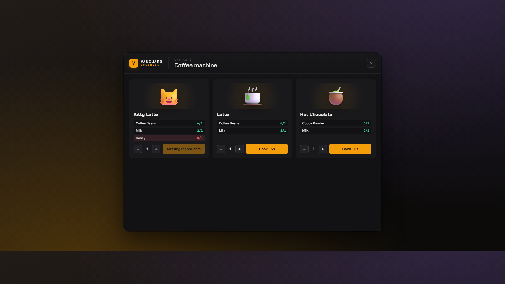
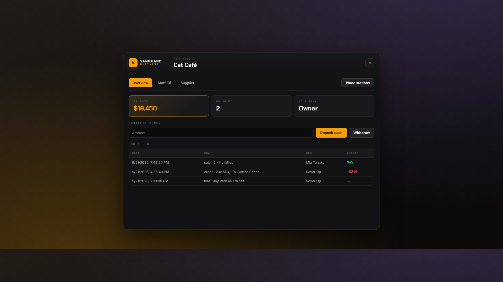
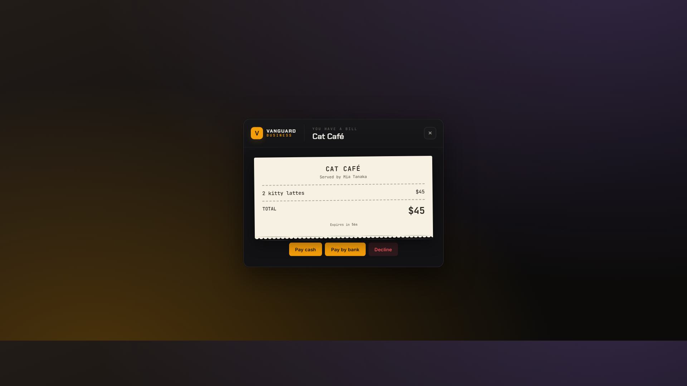

# Vanguard Business

Player-run food businesses for FiveM — cafés, burger bars, pizzerias, bakeries, bars — in **any building**. Server admins create a business in-game, place its fridge, cooking stations, register, boss desk and doors by pointing at them, and hand it to a player. That player hires staff, orders stock, cooks, bills customers and locks up. No coordinates in config files.

Works with **QBCore**, **Qbox** and **ESX** (auto-detected). Companion to Vanguard Admin.



## Features

- **Six starter types** — coffee shop, cat café, burger bar, pizzeria, bakery, bar. Any type fits any building; add your own in `shared/types.lua`.
- **Placement tool** — aim and click to place the fridge, cooking stations, cash register, boss desk, clock-in point, doors (incl. double doors) and a map icon. Move or delete them the same way.
- **Staff & ranks** — Trainee, Staff, Manager, Owner, each with its own permissions (`config.lua`). You can only hire, fire or promote people below you. Clock in to work.
- **Paychecks** — every 15 minutes on shift each employee gets their rank's pay in the bank (Trainee $1,500, Staff $2,000, Manager $3,000, Owner $4,000 by default), paid out of the business account (set `Config.Paycheck.FromBusiness = false` to have the city pay instead). Set in `Config.Paycheck`.
- **Boss desk** — balance, deposit / withdraw, money log, team, hiring, supplier orders paid from the business account and delivered to the fridge.
- **Cooking** — each station shows what it can make, what you have and what's missing. Cook up to 10 at once. Walk away or cancel and the ingredients come back.
- **Cash register** — bill a customer at the counter; they pay cash or bank from a receipt pop-up. The employee gets a commission.
- **Door locks** — staff walk up to a door and press **E** to lock or unlock it (or use third-eye with `Config.DoorsUseTarget`). Everyone else sees "Locked". Locks are re-applied continuously, so interiors can't leave a locked door swinging.
- **Food & drink** — 26 products and 21 ingredients with pictures. Every item has its own hunger / thirst value (100 = completely full).
- **Server-checked** — every action re-checks distance to the station, rank, permission and shift on the server. Balances can never go negative, even when two people spend at once.




## Requirements

- `oxmysql`
- One of: **QBCore + qb-inventory**, **Qbox + ox_inventory**, **ESX + ox_inventory**
- Optional: `ox_target` or `qb-target` (otherwise players get **[E]** prompts)

## Installation

1. Put the `vanguard-business` folder in your `resources` folder.
2. Add to `server.cfg` (after your framework, inventory and target):

   ```cfg
   ensure vanguard-business
   add_ace group.admin vanguard.business.admin allow
   ```

3. Copy the pictures from `vanguard-business/images/` into your inventory's picture folder:
   - qb-inventory: `qb-inventory/html/images/`
   - ox_inventory: `ox_inventory/web/images/`
4. **ox_inventory only:** open `install/ox_inventory_items.lua` and paste the entries into `ox_inventory/data/items.lua`. (QBCore adds the items by itself.)
5. Restart the server. The database tables are created automatically.

## Setting up a business (in-game)

1. Type **`/business`** → **New business** → name it (e.g. "Cat Café"), pick a type, **Create**.
2. **Set owner**: type the player's server ID (yours works too).
3. Stand inside the building and press **Place stations**. Look where a station goes and click:

   | Key | Does |
   |---|---|
   | ← → | change what you're placing (fridge, coffee machine, grill, register, boss desk, clock-in, door, map icon) |
   | Click | place it (for doors: aim at the door) |
   | Shift + Click | second half of a double door (add both halves, or the other half stays open) |
   | Mouse wheel | rotate |
   | Delete | remove the station / door you're aiming at |
   | Backspace | done |

4. The Owner goes to the **boss desk** → **Staff** → hires people → **Supplier** → orders ingredients.
5. Staff **clock in**, take ingredients from the **fridge**, and cook at the stations (third-eye / Left Alt, or [E]).

## Making your own food or business type

Everything is in `shared/types.lua`:

- **New food** — add it to `Products` (label, weight, `kind` = food/drink, `hunger` / `thirst` 0-100, `prop`, `emoji`) and to `Recipes` (station, time, ingredients).
- **New ingredient** — add it to `Ingredients` and give it a price in `SupplierPrices`.
- **New business type** — copy an entry in `BusinessTypes`, rename it, and list its stations, recipes and supplier items.
- Pictures: `npm run images` downloads a Fluent Emoji picture for every `emoji` name, or drop your own `vb_<item>.png` in `images/`.
- ox_inventory users: run `npm run ox-items` to regenerate `install/ox_inventory_items.lua`.

`npm test` checks that every recipe can be cooked and bought within its business type.

## Commands and permissions

| What | How |
|---|---|
| Your jobs / admin panel | `/business` |
| Business admin (create, owners, placement) | `add_ace <group> vanguard.business.admin allow` |
| Let Owners place their own stations | `Config.OwnersCanPlace = true` |

## Development

`npm install`, then `npm test` (rules and data tests on a Lua VM), `npm run lint` (syntax). Open `html/index.html` in a browser for a preview with sample data (`#home`, `#boss`, `#cook`, `#register`, `#bill`, `#progress`, `#placement`).

## License

MIT © 2026 Rover — see [LICENSE](LICENSE). Item pictures: [Microsoft Fluent Emoji](https://github.com/microsoft/fluentui-emoji), MIT.
